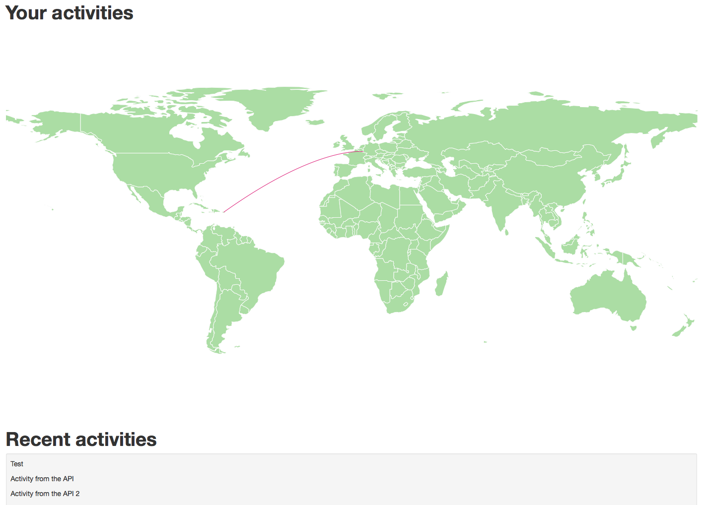

# Activity maps

Sees your activities in real-time on a world map.

# Technology stack

This project use [Meteor](http://www.meteor.com/) with [Meteorite](https://github.com/oortcloud/meteorite).
The SVG map is done using [DataMaps](http://datamaps.github.io/).
The API is done with [meteor-collectionapi](https://github.com/crazytoad/meteor-collectionapi).
The map is updated on activity insert thanks to [meteor-collection-hooks](https://github.com/matb33/meteor-collection-hooks).

# Make it runs

You have to install meteor and meteorite first, then clone this repository and execute meteor:

    curl https://install.meteor.com | /bin/sh
    npm install -g meteorite
    git clone https://github.com/KNEIP/activity_maps.git
    cd activity_maps/
    mrt

Now open your browser to http://localhost:3000/.

# REST API

This application include an API in order to create activities.

## GET activities

Returns all activities stored

    $ curl http://localhost:3000/api/activities

## GET activity

Returns the activity for the given id

    $ curl http://localhost:3000/api/activities/Bc8FsaNcqznqh6iew

## POST activities

Create a new activity

    $ curl -d "{\"iso\": \"pr\", \"message\": \"This is my message\"}" http://localhost:3000/api/activities
